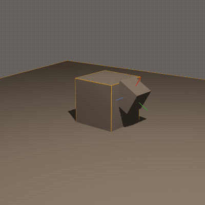

# muscley-wusaley README

I'm gonna try to just do more open development here so people can see the scratch pad I'm using.

* [First toot](https://mastodon.gamedev.place/@shanecelis/110830924772262798); tagged [toot0](https://github.com/shanecelis/muscley-wusaley/tree/toot0)

