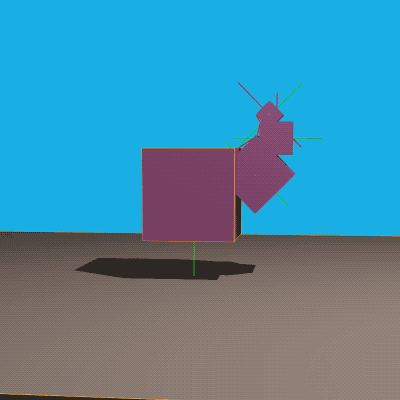
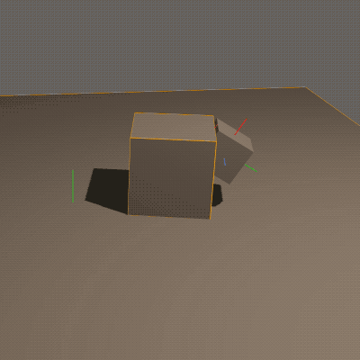
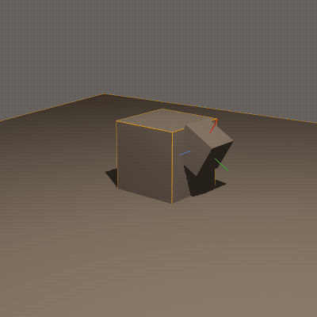
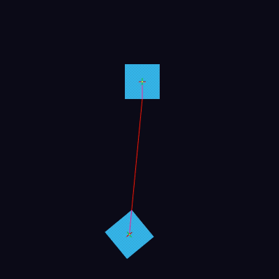
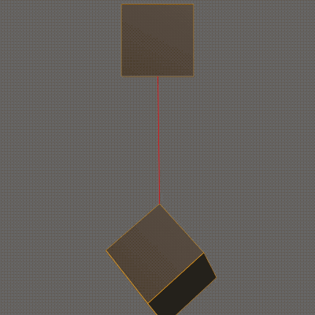
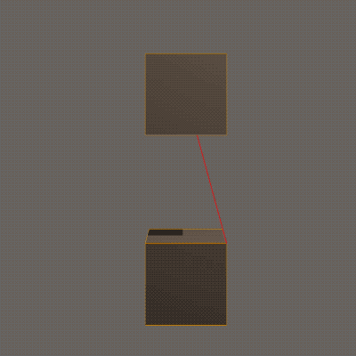

# creatura README

I'm gonna try to just do more open development here so people can see the scratch pad I'm using.

# And the last toots shall be first

* [Hi](https://mastodon.gamedev.place/@shanecelis/110842014157118662); tagged [toot2](https://github.com/shanecelis/muscley-wusaley/tree/toot2)

* [Try to make this tootable-repo a thing](https://mastodon.gamedev.place/@shanecelis/110831084150608229); tagged [toot1](https://github.com/shanecelis/muscley-wusaley/tree/toot1)

* [Makin' some muscles](https://mastodon.gamedev.place/@shanecelis/110830924772262798); tagged [toot0](https://github.com/shanecelis/muscley-wusaley/tree/toot0)

* [Going the distance](https://mastodon.gamedev.place/@shanecelis/110819071026010859)

* [Failing to make a distance joint](https://mastodon.gamedev.place/@shanecelis/110810035869682631)

